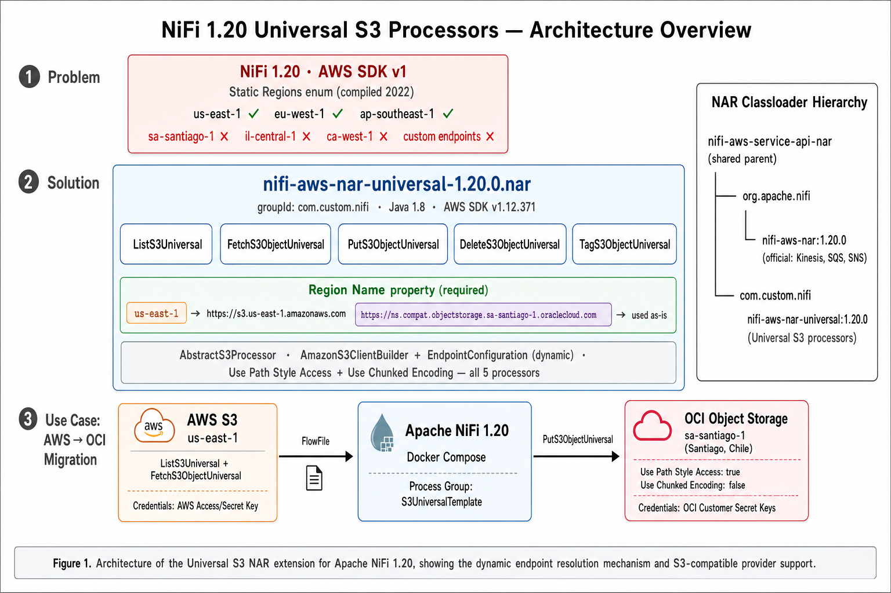
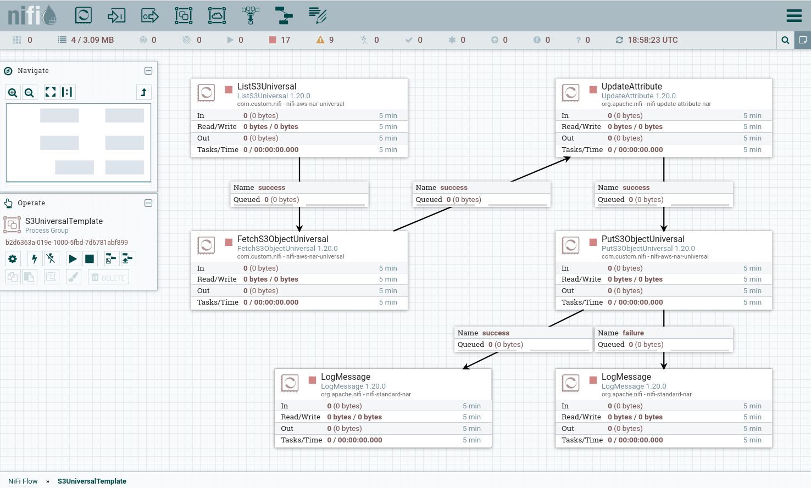

# NiFi 1.20 — Universal S3 Processors

**[@edronald7](https://github.com/edronald7)** · Apache NiFi 1.20 · Java 1.8 · AWS SDK v1.12.371

---

## Abstract

Apache NiFi 1.20 includes S3 processors that rely on a static enumeration of AWS regions
(`com.amazonaws.regions.Regions`) compiled in 2022. This enumeration does not cover regions
released after that date, nor S3-compatible endpoints from providers such as
Oracle Cloud Infrastructure (OCI), MinIO, or Cloudflare R2.

This project delivers five drop-in replacement processors — collectively referred to as
*Universal S3 Processors* — that resolve the region constraint by replacing the static enum
with a dynamic `EndpointConfiguration` built at runtime from a user-supplied value.
The processors are packaged as a standalone NAR (`com.custom.nifi:nifi-aws-nar-universal:1.20.0`)
that coexists with the official NiFi NAR without classloader conflicts.

---

## Architecture



**Figure 1.** Architecture of the Universal S3 NAR extension for Apache NiFi 1.20, showing
the dynamic endpoint resolution mechanism, the NAR classloader hierarchy, and a representative
migration use case from AWS S3 to OCI Object Storage.

---

## 1. Problem Statement

The S3 processors shipped with NiFi 1.20 (`ListS3`, `FetchS3Object`, `PutS3Object`,
`DeleteS3Object`, `TagS3Object`) delegate region configuration to
`com.amazonaws.regions.Regions.fromName(String)`. This method throws
`IllegalArgumentException` for any region code absent from the SDK's compiled list,
making the processors unusable with:

- **New AWS regions** launched after the SDK snapshot date (e.g., `il-central-1`, `ca-west-1`).
- **OCI Object Storage** S3-compatible endpoints, which use region codes such as
  `sa-santiago-1` or `eu-frankfurt-1` that do not follow the AWS naming convention.
- **Any other S3-compatible provider** that exposes a custom endpoint URL.

| Region | Provider | NiFi 1.20 stock |
|---|---|---|
| `il-central-1` (Israel) | AWS | ✗ unsupported |
| `ca-west-1` (Calgary) | AWS | ✗ unsupported |
| `sa-santiago-1` (Santiago, Chile) | OCI | ✗ unsupported |
| `eu-frankfurt-1` (Frankfurt) | OCI | ✗ unsupported |
| `https://minio.company.com` | MinIO | ✗ unsupported |

---

## 2. Solution

### 2.1 Dynamic endpoint resolution

Each Universal processor exposes a mandatory `Region Name` property that accepts either
a region code or a full endpoint URL:

```
# AWS region code (new or existing)
us-east-1
il-central-1

# Full S3-compatible endpoint URL
https://<namespace>.compat.objectstorage.sa-santiago-1.oraclecloud.com
https://minio.company.com
https://<account-id>.r2.cloudflarestorage.com
```

Detection is automatic: values containing `://` are treated as endpoint URLs;
all other values are expanded to `https://s3.<region>.amazonaws.com`.
The signing region is extracted from the URL via a generalised regex pattern,
covering both AWS directional names (`east`, `west`) and city-based names
(`santiago`, `frankfurt`, `london`).

### 2.2 Processors

| Universal processor | Replaces |
|---|---|
| `ListS3Universal` | `ListS3` |
| `FetchS3ObjectUniversal` | `FetchS3Object` |
| `PutS3ObjectUniversal` | `PutS3Object` |
| `DeleteS3ObjectUniversal` | `DeleteS3Object` |
| `TagS3ObjectUniversal` | `TagS3Object` |

### 2.3 Classloader isolation

The NAR uses a custom `groupId` (`com.custom.nifi`) and declares
`nifi-aws-service-api-nar` as its parent NAR, the same parent used by the official
`org.apache.nifi:nifi-aws-nar`. This allows both NARs to coexist in the same NiFi
instance without classloader conflicts, preserving full functionality for
Kinesis, SQS, SNS, and other official AWS processors.

```
nifi-aws-service-api-nar          (shared parent)
├── org.apache.nifi : nifi-aws-nar:1.20.0
│   └── Kinesis, SQS, SNS, ...
└── com.custom.nifi : nifi-aws-nar-universal:1.20.0
    └── ListS3Universal, FetchS3ObjectUniversal, ...
```

---

## 3. NiFi flow preview



**Figure 2.** `S3UniversalTemplate` process group in the NiFi 1.20 canvas, illustrating
a migration pipeline: `ListS3Universal` discovers objects in a source bucket,
`FetchS3ObjectUniversal` downloads each object, `UpdateAttribute` sets routing metadata,
and `PutS3ObjectUniversal` writes the object to the destination bucket.
`LogMessage` processors capture success and failure events.

---

## 4. Installation

### 4.1 Deploy the NAR

1. Download [`dist/nifi-aws-nar-universal-1.20.0.nar`](dist/nifi-aws-nar-universal-1.20.0.nar).
2. Copy to NiFi's `extensions/` directory and restart NiFi.

```bash
# Standalone NiFi
cp nifi-aws-nar-universal-1.20.0.nar /opt/nifi/nifi-current/extensions/

# Docker Compose (if ./lib maps to extensions/)
cp nifi-aws-nar-universal-1.20.0.nar ./lib/
docker compose down && docker compose up -d
```

> Do **not** remove the official `nifi-aws-nar-1.20.0.nar` — both NARs must be present.

### 4.2 Import the flow template

1. Download [`dist/S3UniversalTemplate.xml`](dist/S3UniversalTemplate.xml).
2. In NiFi: top menu → **Upload Template** → select the XML file.
3. Drag the `S3UniversalTemplate` onto the canvas and configure the properties.

### 4.3 Key properties for S3-compatible providers

| Property | AWS S3 | OCI / other S3-compatible |
|---|---|---|
| **Region Name** | `us-east-1` | `https://<ns>.compat.objectstorage.<region>.oraclecloud.com` |
| **Use Path Style Access** | `false` | `true` |
| **Use Chunked Encoding** | `true` | `false` |

For detailed OCI credential setup (namespace, Customer Secret Keys, IAM policies)
see [`docs/oci_en.md`](docs/oci_en.md).

---

## 5. Building from source

**Prerequisites:** Java 1.8 ([sdkman](https://sdkman.io/) recommended), Maven 3.6+

```bash
sdk use java 8.<version>

cd nifi-source/nifi-nar-bundles/nifi-aws-bundle

mvn clean package \
  -pl nifi-aws-abstract-processors,nifi-aws-processors,nifi-aws-nar-universal \
  -am -DskipTests
```

Output:
```
nifi-source/.../nifi-aws-nar-universal/target/nifi-aws-nar-universal-1.20.0.nar
```

For clean-environment build steps (empty `~/.m2`) see [`docs/changes_en.md`](docs/changes_en.md).

---

## 6. Compatibility

### NiFi versions

| NiFi version | Status | Notes |
|---|---|---|
| **1.20.0** | ✅ Tested | reference version |
| 1.16.x — 1.19.x | ⚠️ Expected | same APIs; bump version in the three POMs and recompile |
| **2.x** | ❌ Incompatible | requires Java 21, AWS SDK v2, new processor API |

### S3-compatible providers

| Provider | `Region Name` value | `Path Style` |
|---|---|---|
| **AWS S3** | region code: `us-east-1` | `false` |
| **OCI Object Storage** | `https://<ns>.compat.objectstorage.<region>.oraclecloud.com` | `true` |
| **MinIO** | `https://minio.company.com` | `true` |
| **Cloudflare R2** | `https://<account-id>.r2.cloudflarestorage.com` | `true` |
| **Google Cloud Storage** | `https://storage.googleapis.com` | `true` |
| **Backblaze B2** | `https://s3.<region>.backblazeb2.com` | `true` |
| **Wasabi** | `https://s3.<region>.wasabisys.com` | `true` |
| **DigitalOcean Spaces** | `https://<region>.digitaloceanspaces.com` | `true` |
| **IBM Cloud Object Storage** | `https://s3.<region>.cloud-object-storage.appdomain.cloud` | `true` |
| **Alibaba Cloud OSS** | `https://oss-<region>.aliyuncs.com` | `true` |
| **NetApp StorageGRID / Ceph** | `https://<company-endpoint>` | `true` |

---

## 7. Documentation

| Document | Description |
|---|---|
| [`docs/changes_en.md`](docs/changes_en.md) | Full changelog, bug fixes, and technical decisions |
| [`docs/oci_en.md`](docs/oci_en.md) | Step-by-step guide for configuring OCI credentials |
| [`docs/test_en.md`](docs/test_en.md) | Test case: AWS S3 → OCI Santiago migration |

> 📄 Documentation is also available in Spanish:
> [`changes_es.md`](docs/changes_es.md) · [`oci_es.md`](docs/oci_es.md) · [`test_es.md`](docs/test_es.md)

---

## 8. Repository structure

```
├── readme.md                              ← this document
├── .gitignore
│
├── dist/                                  ← ready-to-use artifacts
│   ├── nifi-aws-nar-universal-1.20.0.nar  ← copy to NiFi extensions/
│   └── S3UniversalTemplate.xml            ← import into NiFi canvas
│
├── docs/                                  ← documentation and figures
│   ├── diagram.png                        ← Figure 1 — architecture
│   ├── preview.png                        ← Figure 2 — NiFi canvas
│   ├── changes_en.md  /  changes_es.md    ← full changelog (EN / ES)
│   ├── oci_en.md      /  oci_es.md        ← OCI credential setup guide (EN / ES)
│   └── test_en.md     /  test_es.md       ← test case: AWS S3 → OCI (EN / ES)
│
└── nifi-source/                           ← Java / Maven source code
    └── nifi-nar-bundles/
        └── nifi-aws-bundle/
            ├── nifi-aws-abstract-processors/
            ├── nifi-aws-processors/
            └── nifi-aws-nar-universal/
```

---

## Related projects

### [apache-nifi-local-dev-env](https://github.com/edronald7/apache-nifi-local-dev-env)

A ready-to-use Docker Compose environment for Apache NiFi 1.20 that already ships with
`nifi-aws-nar-universal-1.20.0.nar` deployed and tested. Useful for trying out the Universal
processors without building from source.

Key features of that environment:
- NiFi 1.20.0 running on port 8080 with persistent volumes
- `lib/nifi-aws-nar-universal-1.20.0.nar` mounted into `extensions/` — ready to use
- AWS and OCI credential setup guide (file-based and Docker volume)
- `.env` file for credentials and port configuration

```bash
git clone https://github.com/edronald7/apache-nifi-local-dev-env
cd apache-nifi-local-dev-env
cp .env.example .env
docker compose up -d
# Open http://localhost:8080/nifi
```

---

## References

1. Apache NiFi Project. *Apache NiFi Documentation — NiFi 1.20.0.*
   https://nifi.apache.org/docs.html

2. Apache NiFi GitHub. *nifi/nifi-nar-bundles/nifi-aws-bundle*, tag `rel/nifi-1.20.0`.
   https://github.com/apache/nifi/tree/rel/nifi-1.20.0/nifi-nar-bundles/nifi-aws-bundle

3. Amazon Web Services. *AWS SDK for Java Developer Guide — Amazon S3 Client.*
   https://docs.aws.amazon.com/sdk-for-java/v1/developer-guide/welcome.html

4. Amazon Web Services. *AmazonS3ClientBuilder — AWS SDK for Java 1.x API Reference.*
   https://docs.aws.amazon.com/AWSJavaSDK/latest/javadoc/com/amazonaws/services/s3/AmazonS3ClientBuilder.html

5. Oracle Cloud Infrastructure. *Amazon S3 Compatibility API — Object Storage.*
   https://docs.oracle.com/en-us/iaas/Content/Object/Tasks/s3compatibleapi.htm

6. Oracle Cloud Infrastructure. *Regions and Availability Domains.*
   https://docs.oracle.com/en-us/iaas/Content/General/Concepts/regions.htm

7. Apache Maven Project. *NAR Plugin — nifi-nar-maven-plugin.*
   https://github.com/apache/nifi/tree/main/nifi-nar-maven-plugin

---

## License

This project is derived from the official Apache NiFi source code and is distributed under the
[Apache License 2.0](https://www.apache.org/licenses/LICENSE-2.0).
